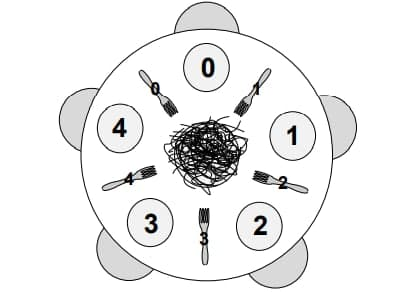

# Dinning Philosophers

## Problema

Este problema clássico consiste em modelar uma situação onde cinco filósofos estão sentados a uma mesa redonda.
A mesa possui uma fonte de comida na mesa, como spaghetti, e um prato para cada filósofo, mas uma quantidade
limitada de garfos, que é igual à quantidade de filósofos. Cada filósofo tem um ciclo de atividades, 
onde ele pensa e come, mas para comer ele precisa de dois garfos, o garfo da sua direita e o garfo da sua esquerda.
Uma vez que o filósofo termina de comer, ele retorna ambos os garfos para a mesa.

A situação clássica se dá com 5 filósofos e 5 garfos em uma mesa redonda, ilustrada pela figura abaixo.

## Restrições

As restrições são:
* Apenas um filósofo pode segurar um mesmo garfo ao mesmo tempo;
* Deve ser impossível um deadlock de ocorrer;
* Deve ser impossível um filósofo morrer de fome enquanto espera por um garfo;
* Deve ser possível para mais de um filósofo comer ao mesmo tempo.

## Solução

A solução foi modelada principalmente com uma classe Philosopher e uma classe Table. Um Philosopher tem um comportamento
em que pensa por um determinado tempo em segundos, pega os garfos, come por um determinado tempo em segundos e devolve
os garfos. Isso se repete indefinidamente, ou por uma quantidade de iterações se especificado no construtor. Algo que
vale apontar é que esta solução inclui a opção do Philosopher ser canhoto (leftie); isso foi feito para livrar o problema
do deadlock que ocorre quando todos os filósofos pegam o seu garfo direito ao mesmo tempo e esperam para sempre pelo
esquerdo que nunca será liberado. Na situação de ao menos um Philosopher ser canhoto, isso não vai ocorrer, pois ou ele
será bloqueado tentando pegar o garfo direito de seu vizinho esquerdo, ou pegará seu garfo esquerdo e permitirá seu vizinho
direito pegar também o garfo esquerdo. No sentido de implementação, se o Philosopher for canhoto, ele sempre vai pegar
priorizar o garfo esquerdo em getForks() para pegar e em putForks() para devolver; caso o contrário, vai priorizar o 
direito.

A classe Table controla um array de Philosophers e suas posições, bem como um array de garfos de mesmo comprimento. Para 
maior organização, é usado o enum Availability com os estados Available e Unavailable para marcar a disponibilidade dos 
garfos. Se um Philosopher tentar chamar getForks(), com um dos garfos, mas aquele garfo estiver ocupado, o Philosopher 
fica bloqueado até algum garfo ser retornado, e ele pode checar de novo. Adicionalmente, quando um Philosopher chamar 
putForks() ele notifica todos os outros Philosophers que um garfo foi retornado.

Na classe Example foram recriados as duas situações: a primeira na qual tem a chance de ocorrer o deadlock com 5 
filósofos destros, e a segunda na qual a chance não existe com 4 filósofos destros e 1 canhoto.
